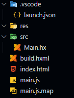
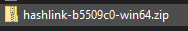

# Project Structure

# As a Web Game
Your project structure should look similar to this if you managed to set it up by following the [Heaps Documentation](https://heaps.io/documentation/hello-world.html)



But, if you haven't set it up yet, then I would recommend you follow my project structure from the image above.

## Files

### Build.hxml
```hxml
-cp src
-lib heaps
-js main.js
-main Main
-debug
```

`-cp src` is saying where it should locate the project files, by default, it searches the WorkSpace folder

`-lib heaps` is basically referencing what libraries you want to use in your project, for you to use libraries, you will need to install them ([Check out Libraries Here](https://lib.haxe.org/))

`-js main.js` is saying how we want to build our game, whether to use Javascript, DirectX or OpenGL. In this case, we're using Javscript, `main.js` is the name for the javascript that it needs to create.

`-main Main` is showing the build file what our Main project file is, it automatically just guesses the file has `.hx` extension, so only the name of the Main file is required.

`-debug` means whether or not to run in DEBUG mode

### index.html

```html
<!DOCTYPE>
<html>
<head>
	<meta charset="utf-8"/>
	<title>Hello, Heaps</title>
	<style>
		body { margin:0;padding:0;background-color:black; }
		canvas#webgl { width:100%;height:100%; } 
	</style>
</head>
<body>
	<canvas id="webgl"></canvas>
	<script type="text/javascript" src="main.js"></script>
</body>
</html>
```

### launch.json

```json
{
	"version": "0.2.0",
	"configurations": [
		{
			"type": "chrome",
			"request": "launch",
			"name": "Launch Chrome against localhost",
			"url": "file://${workspaceFolder}/index.html",
			"webRoot": "${workspaceFolder}",
			"preLaunchTask": {
				"type" : "haxe",
				"args" : "active configuration"
			}
		}
	]
}
```

### Main.hx

```haxe
class Main extends hxd.App {
    override function init() {

    }
    
    override function update(dt:Float) {

    }

    static function main() {
        new Main();
    }
}
```

# As an Executable File

While running it on a WebPage may be fine, some of you may want to run it as an executable file.

you'll need to change your **launch.json**  file in *.vscode* to the code shown below
```json
{
	"version": "0.2.0",
	"configurations": [
		{
			"name": "HashLink (launch)",
			"request": "launch",
			"type": "hl",
			"cwd": "${workspaceFolder}",
			"preLaunchTask": {
			  "type": "haxe",
			  "args": "active configuration"
			}
		  },
		  {
			"name": "HashLink (attach)",
			"request": "attach",
			"port": 6112,
			"type": "hl",
			"cwd": "${workspaceFolder}",
			"preLaunchTask": {
			  "type": "haxe",
			  "args": "active configuration"
			}
		  }
	]
}
```

Now, There's two ways of doing this, One is by using SDL through *HLSDL*:

- `haxelib install hlsdl 1.13.0`

And the other way is by using DirectX through *HLDX*:

- `haxelib install hldx 1.13.0`

You may be wondering, "What's the difference between the two?" Well;

*HLSDL* is more focused on Cross-Platform development

While *HLDX* is more focused on Windows-specific development, or in other words, *HLDX* is limited to only the Windows Operating System.

I am using *HLSDL* for this tutorial, but feel free to use *HLDX* instead.

once you have either one installed, we can move on. The only thing you'll need to do is edit your `.hxml` file, and add 4 new lines:


For information about `-D dce=full`, check out [Docs For It](https://haxe.org/manual/cr-dce.html)

`client.hl` can be renamed to whatever you want, but it must have the `.hl` extension (this goes for HLDX also)

If you're using *HLDX*, just replace `-lib hlsdl` with `-lib hldx`

Upon running (by pressing F5), a window should show up, but some may encounter an error like:

`src\module.c(506) : FATAL ERROR : Failed to load function sdl@get_window_grab`

this can be fixed by running the following commands one by one in Visual Studio Code's terminal:

`haxelib git heaps https://github.com/HeapsIO/heaps`

`haxelib set heaps git`

`haxelib git hlsdl https://github.com/HaxeFoundation/hashlink master libs/sdl`

`haxelib git hldx` (for HLDX users)

If the issue still persists, you can also try installing the [nightly build](https://github.com/HaxeFoundation/hashlink/releases) for Hashlink, once you have installed it, you can follow these steps:

Locate and Open the ZIP file you downloaded and open the Folder that is inside of it



Once the folder is open, copy all the contents by CTRL + A and CTRL + B


Next, find a folder called **HaxeToolkit**, for me, it's in my *C:* drive. And then open another folder called *hl*


Once your inside that folder, press *CTRL + A* and then *CTRL + V*, and replace all files.

#### ~Don't forget to add the HL folder to your PATH~

And now simply Re-open visual studio code and run it again.

If you're on a Linux Distribution, you'll need to download one of the assets of the Nightly Build (for hashlink) based on your system

there's two versions

the AMD64 version and the i386 version

AMD64 is for x64 bit computers, while i386 are for x86 or x36 bit computers