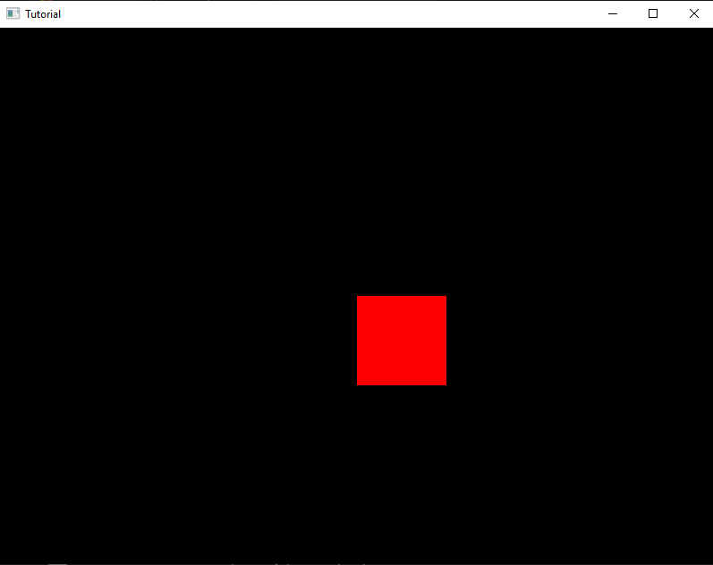
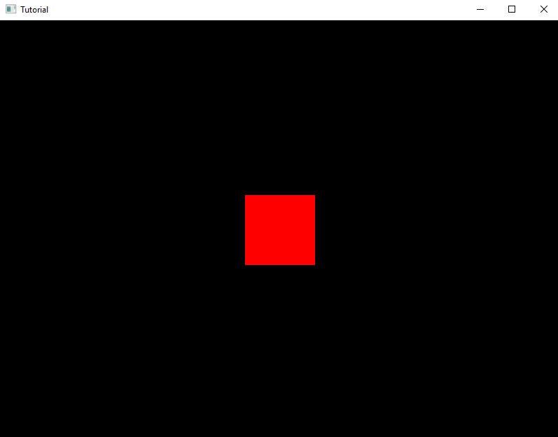

One of the basics, is creating Shapes, and we can do that by typing this in `hxd.App` inside the brackets:

```haxe
var bitmap = h2d.Bitmap;
```

Realize how there's no `new` statement before it, that's because we're gonna edit it in the `init` function. 
`h2d.Bitmap` is a way of drawing a single tile, but it isn't recommended as it causes an increase in *Draw Calls* (we'll talk about this later)

Now, add another line in the `init` function (between the brackets):

```haxe
var tile = h2d.Tile.fromColor(0xFF0000, 100, 100);
```

This takes three parameters, the *Color*, *Width* and *Height* of the Shape. `fromColor` is specifying that the Tile should be colored.

Additionally, we would want to see the Tile on the screen, start by typing:

```haxe
bmp = new Bitmap(tile, s2d);
```

And with this, we should now see a Red Square on our Project


## Shape Manipulation

What if we want to change the position of the shape? we can do so by typing this in the `init` function:

```haxe
bmp.x = s2d.width * 0.5;
bmp.y = s2d.height * 0.5;
```

See how we're referencing `bmp` instead of `tile`? this is because `bmp` is in charge of actually bringing the `tile` unto the screen, And we can play around  with the `x` and `y` values of it. `s2d.width` and `s2d.height` is a way of checking the scene's width and  height (basically the screen's width and height), and we multiplied that by `0.5`, and  this makes the Square completely in the center of the screen. Now, once we run our Project, we get...



Well, it's not exactly centered, is it? we can fix that by manipulating the Anchor point of the Square by typing this in the `init` function:

```haxe
tile.dx = -tile.width / 2;
tile.dy = -tile.height / 2;
```

You may have noticed that we're now referencing the `tile` and not the `bmp`, this is because the `tile` has it's own set of properties that the `bmp` doesn't have. `-tile.width / 2;` is changing the Anchor Point (dx) to negative and dividing that by `2`, same goes for `tile.dy`. So why `-tile.width` and not `tile.width`? Because `tile.width` will be adding on top of the original *Width* of the *tile*, same also goes  for `tile.height`.

and with that, we have a perfectly centered Square

