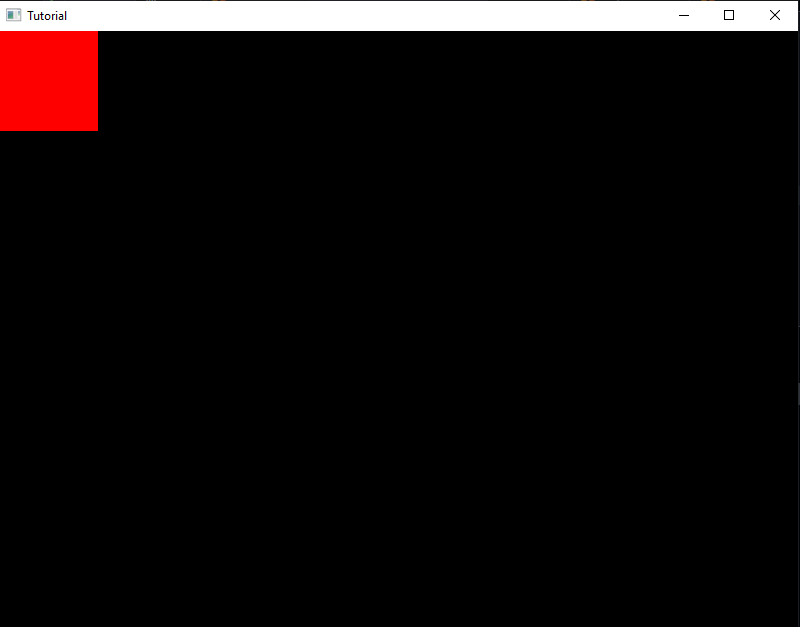

One of the basics, is creating Shapes, and we can do that by typing this in `hxd.App` inside the brackets:

```haxe
var bitmap = h2d.Bitmap;
```

Realize how there's no `new` statement before it, that's because we're gonna edit it in the `init` function. 
`h2d.Bitmap` is a way of drawing a single tile, but it isn't recommended as it causes an increase in *Draw Calls* (we'll talk about this later)

Now, add another line in the `init` function (between the brackets):

```haxe
var tile = h2d.Tile.fromColor(0xFF0000, 100, 100);
```

This takes three parameters, the *Color*, *Width* and *Height* of the Shape. `fromColor` is specifying that the Tile should be colored.

Additionally, we would want to see the Tile on the screen, start by typing:

```haxe
bmp = new Bitmap(tile, s2d);
```

And with this, we should now see a Red Square on our Project

