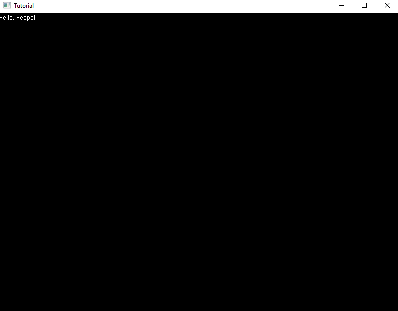
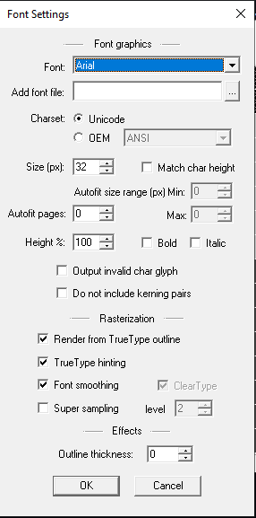
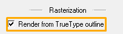

## Default Font

In the *Project Structure* page, we gave the code for each of the files, as well as the *Main.hx* file that we are gonna edit now, if you don't have a *Main.hx* file, make one and copy the code below:

```haxe
class Main extends hxd.App {    
    override function init() {
        
    }
    
    override function update(dt:Float) {

    }

    static function main() {
        new Main();
    }
}
```

Now, let's start with adding a basic text with the default font, we can do this by typing this line in the `init` function between the brackets:

```haxe
var tf = new Text(hxd.res.DefaultFont.get());
```

this creates a new variable which we named `tf`, next we assign an object to it (In this case, it's `Text`) with `new` before it so it'll know to create a new instance of the object. Next, between the parentheses, we added `DefaultFont.get()`, this simply get's the default font that is provided. Now, we can specify what  we want the text to show, via a String:

```haxe
tf.text = "Hello, Heaps!;
```


We referenced our variable called *tf* along with a property of it, which is `.Text`. Next we specified what we want the Text to say between double quotation marks (As a STRING is required)

If we run our Project now (By pressing F5), you'll see nothing, that's because  we haven't added it to the Project *Scene* yet, we can do this by typing:

```haxe
s2d.addChild(tf)
```

`s2d` is short for *Scene 2 Dimensional*, we can think of scenes like a folder consisting of papers, and those papers represent the Texts and Game Objects in that scene, and we're adding another *paper* into that folder which is `tf`, with `.addChild`

The final result should look like this:



along with the code looking like this:

```haxe
import hxd.res.DefaultFont;
import h2d.Text;

class Main extends hxd.App {    
    override function init() {
        var tf = new Text(DefaultFont.get());
        tf.text = "Hello, Heaps!";

        s2d.addChild(tf);
    }
    
    override function update(dt:Float) {

    }

    static function main() {
        new Main();
    }
}
```

## Custom Fonts 

So, what if we want to use Custom Fonts? first off, you'll need to download a program called [BMFont](http://www.angelcode.com/products/bmfont/), there's multiple [options](https://heaps.io/documentation/text.html) but I'll be using BMFont for this tutorial.  Once BMFont is opened, you should see this window


If your characters background look dark compared to mines, just click on each one of them until all are lit up.

Now, press **F** on your keyboard, once pressed, you should see this:



Once on that window, click on "Render from TrueType outline" under  Rasterization



You can change the font and font size to your liking, but remember to turn "Render from TrueType outline" on

Next, press "T" on the keyboard to open Export Options, and change the settings which are highlighted below:


And now, you're good to go! press "CTRL + S" and go to your *res* folder in your Project and save it there.

Now, let's change our `Main.hx` file. We need to add a new line on top of our `var tf` line:

```haxe
var customFont = hxd.Res.FontName.toFont();
```

Change `FontName` to the name which you exported font as, `toFont()` is changing the *.fnt* file to a *.bfnt* file which Heaps can understand

now change your `var tf = new Text(DefaultFont.get());` to:

```haxe
var tf = new Text(customFont);
```

As you can see, we switched `DefaultFont.get()` with our customFont variable to set the text font to our desired font.

Next, add one more line but this time in the `main` function between  the brackets:

```haxe
hxd.Res.initEmbed();
```

`.initEmbed()` is used to Embed all our files that is in our *res* folder into the game (Fonts, Images, etc)
now, you should see your custom font in your Project once you run it (I'm using the Arial font)


and your code should look like this:

```haxe
import hxd.res.Font;
import hxd.res.DefaultFont;
import h2d.Text;

class Main extends hxd.App {    
    override function init() {
        var customFont = hxd.Res.Arial.toFont();
        var tf = new Text(customFont);
        tf.text = "Hello, Heaps!";

        s2d.addChild(tf);
    }
    
    override function update(dt:Float) {

    }

    static function main() {
        hxd.Res.initEmbed();
        new Main();
    }
}
```

You can put `hxd.Res.initEmbed();` after `new Main();` and i t'll still work, so if you did do that, don't worry about it. 
